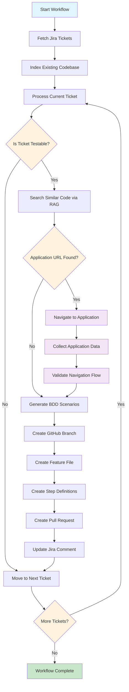

# Jira to BDD Agent Backend

An intelligent agentic workflow system that automatically generates BDD (Behavior-Driven Development) test scenarios from Jira tickets and creates pull requests with the generated tests.

## Overview

This backend service provides a FastAPI-based REST API that orchestrates an automated workflow to:
1. Fetch Jira tickets from sprints
2. Analyze tickets to determine if they require BDD testing
3. Navigate to applications using Playwright MCP for validation and data collection
4. Generate BDD scenarios and step definitions using AI with application context
5. Create GitHub pull requests with the generated tests
6. Update Jira tickets with progress information

## Architecture

The system uses LangGraph for workflow orchestration and integrates with:
- **Jira API** - For fetching tickets and updating comments
- **GitHub API** - For creating branches, files, and pull requests
- **OpenAI API** - For AI-powered BDD generation
- **ChromaDB** - For RAG (Retrieval-Augmented Generation) with existing codebase
- **Hugging Face API** - For embeddings (optional, falls back to local)
- **Playwright MCP** - For automated application navigation and validation

## Available APIs

### 1. Trigger Workflow
**POST** `/workflow/trigger`

Triggers the BDD generation workflow for a specific sprint or all active sprints.

**Request Body:**
```json
{
  "sprint_id": 123,  // Optional: specific sprint ID
  "jira_keys": ["PROJ-123", "PROJ-456"]  // Optional: specific ticket keys
}
```

**Response:**
```json
{
  "status": "running",
  "run_id": "run_20241201_143022",
  "started_at": "2024-12-01T14:30:22.123456",
  "message": "Workflow triggered successfully"
}
```

**Example:**
```bash
curl -X POST "http://localhost:8000/workflow/trigger" \
  -H "Content-Type: application/json" \
  -d '{"sprint_id": 123}'
```

### 2. Get Workflow Status
**GET** `/workflow/status/{run_id}`

Retrieves the current status of a workflow run.

**Response:**
```json
{
  "status": "completed",
  "started_at": "2024-12-01T14:30:22.123456",
  "completed_at": "2024-12-01T14:35:45.789012",
  "sprint_id": 123,
  "result": {
    "completed": true,
    "pr_urls": ["https://github.com/org/repo/pull/123"]
  }
}
```

**Example:**
```bash
curl "http://localhost:8000/workflow/status/run_20241201_143022"
```

### 3. Get All Workflow Runs
**GET** `/workflow/runs`

Retrieves all workflow runs and their statuses.

**Response:**
```json
[
  {
    "status": "completed",
    "started_at": "2024-12-01T14:30:22.123456",
    "completed_at": "2024-12-01T14:35:45.789012",
    "sprint_id": 123
  }
]
```

**Example:**
```bash
curl "http://localhost:8000/workflow/runs"
```

### 4. Health Check
**GET** `/health`

Simple health check endpoint.

**Response:**
```json
{
  "status": "healthy",
  "service": "Jira to BDD Agent"
}
```

**Example:**
```bash
curl "http://localhost:8000/health"
```

### 5. Debug RAG Search
**GET** `/debug/rag-search?query={query}`

Debug endpoint to test RAG search functionality.

**Parameters:**
- `query` (string): Search query for similar code

**Response:**
```json
{
  "query": "user login authentication",
  "results": [
    {
      "content": "Feature: User Authentication\nGiven a user is on the login page...",
      "metadata": {
        "type": "feature",
        "path": "src/features/login.feature",
        "name": "login.feature"
      }
    }
  ]
}
```

**Example:**
```bash
curl "http://localhost:8000/debug/rag-search?query=user%20login"
```

### 6. Debug Jira Tickets
**GET** `/debug/jira-tickets`

Debug endpoint to test Jira connection and fetch tickets.

**Response:**
```json
{
  "tickets": [
    {
      "key": "PROJ-123",
      "summary": "Implement user login functionality",
      "description": "As a user, I want to be able to log in...",
      "acceptance_criteria": "Given valid credentials, user should be able to log in",
      "issue_type": "Story",
      "status": "To Do"
    }
  ]
}
```

**Example:**
```bash
curl "http://localhost:8000/debug/jira-tickets"
```

### 7. Test Application Navigation
**POST** `/debug/test-navigation`

Test application navigation functionality with a sample Jira ticket.

**Request Body:**
```json
{
  "summary": "User login functionality",
  "description": "Navigate to https://example.com/login and test user authentication",
  "acceptance_criteria": "User should be able to click on login button and enter credentials"
}
```

**Response:**
```json
{
  "navigation_needed": true,
  "extracted_url": "https://example.com/login",
  "navigation_instructions": [
    "Navigate to https://example.com/login and test user authentication",
    "User should be able to click on login button and enter credentials"
  ],
  "page_data": {
    "url": "https://example.com/login",
    "title": "Login Page",
    "elements": [
      {
        "type": "button",
        "text": "Login",
        "selector": "#login-button"
      }
    ],
    "forms": [
      {
        "action": "/login",
        "method": "post",
        "inputs": [
          {
            "type": "email",
            "name": "email",
            "placeholder": "Enter your email",
            "required": true
          }
        ]
      }
    ]
  }
}
```

**Example:**
```bash
curl -X POST "http://localhost:8000/debug/test-navigation" \
  -H "Content-Type: application/json" \
  -d '{
    "summary": "User login functionality",
    "description": "Navigate to https://example.com/login and test user authentication",
    "acceptance_criteria": "User should be able to click on login button and enter credentials"
  }'
```

### 8. Validate Application URL
**GET** `/debug/validate-url?url={url}`

Validate if a URL is accessible and extract basic page information.

**Parameters:**
- `url` (string): URL to validate and analyze

**Response:**
```json
{
  "url": "https://example.com",
  "accessible": true,
  "title": "Example Domain",
  "status_code": 200,
  "elements_count": 15,
  "forms_count": 2
}
```

**Example:**
```bash
curl "http://localhost:8000/debug/validate-url?url=https://example.com"
```

## Application Navigation with Playwright MCP

The system includes advanced application navigation capabilities powered by Playwright MCP (Model Context Protocol) through the `application_tools.py` module. This enables automated validation and data collection from web applications to enhance BDD test generation.

### Key Features

- **Automatic URL Extraction**: Extracts application URLs from Jira ticket data using pattern matching
- **Navigation Instruction Parsing**: Identifies navigation steps from ticket descriptions and acceptance criteria
- **Automated Browser Navigation**: Uses Playwright to navigate through applications and collect data
- **Element Discovery**: Automatically discovers buttons, forms, inputs, and other interactive elements
- **Screenshot Capture**: Takes screenshots at each navigation step for visual validation
- **Form Analysis**: Analyzes form structures and input requirements

### Navigation Process

1. **URL Detection**: The system scans Jira ticket content for application URLs using regex patterns
2. **Instruction Extraction**: Parses ticket descriptions for navigation keywords like "click", "enter", "navigate to"
3. **Browser Automation**: Launches a headless Chromium browser and navigates to the detected URL
4. **Element Collection**: Captures page elements including buttons, links, forms, and inputs
5. **Navigation Execution**: Attempts to execute extracted navigation instructions
6. **Data Aggregation**: Collects all discovered elements and navigation flow for BDD generation

### Supported Navigation Patterns

The system recognizes and executes common navigation patterns:
- **Click Actions**: `click on`, `select`, `press`
- **Form Interactions**: `enter`, `fill`, `type`
- **Navigation**: `navigate to`, `go to`, `visit`
- **Search Operations**: `search for`, `find`
- **Authentication**: `login`, `sign in`

### Integration with BDD Generation

The collected application data enhances BDD test generation by:
- Providing real element selectors and attributes
- Capturing actual form structures and validation rules
- Documenting navigation flows with screenshots
- Ensuring generated tests match the actual application interface

## Workflow Flow Diagram



## Setup Instructions

### Prerequisites

- Python 3.8 or higher
- Access to Jira instance with API token
- GitHub repository with appropriate permissions
- OpenAI API key
- (Optional) Hugging Face API key for embeddings
- Playwright browser dependencies (automatically installed)

### 1. Environment Configuration

Create a `.env` file in the backend directory with the following variables:

```env
# Jira Configuration
JIRA_URL=https://your-company.atlassian.net
JIRA_EMAIL=your-email@company.com
JIRA_API_TOKEN=your-jira-api-token

# GitHub Configuration
GITHUB_TOKEN=your-github-personal-access-token
GITHUB_REPO=your-org/your-repo
GITHUB_BRANCH_PREFIX=feature/auto-bdd

# LLM Configuration
OPENAI_API_KEY=your-openai-api-key
HUGGINGFACE_API_KEY=your-huggingface-api-key  # Optional
MODEL_NAME=gpt-4

# RAG Configuration
VECTOR_DB_PATH=./chroma_db
```

### 2. Install Dependencies

```bash
cd backend
pip install -r requirements.txt
```

### 3. Install Playwright Browsers

After installing the Python dependencies, install the required browser binaries:

```bash
playwright install chromium
```

This installs the Chromium browser that will be used for automated navigation.

### 4. Required API Keys and Tokens

#### Jira API Token
1. Go to [Atlassian Account Settings](https://id.atlassian.com/manage-profile/security/api-tokens)
2. Click "Create API token"
3. Give it a label (e.g., "BDD Agent")
4. Copy the generated token

#### GitHub Personal Access Token
1. Go to GitHub Settings > Developer settings > Personal access tokens
2. Click "Generate new token (classic)"
3. Select scopes: `repo`, `workflow` (if using GitHub Actions)
4. Copy the generated token

#### OpenAI API Key
1. Go to [OpenAI Platform](https://platform.openai.com/api-keys)
2. Click "Create new secret key"
3. Copy the generated key

#### Hugging Face API Key (Optional)
1. Go to [Hugging Face Settings](https://huggingface.co/settings/tokens)
2. Click "New token"
3. Select "Read" access
4. Copy the generated token

### 5. Repository Structure

Ensure your GitHub repository has the following structure:
```
your-repo/
├── src/
│   ├── features/          # Gherkin feature files
│   └── step-definitions/  # TypeScript step definitions
└── ...
```

### 6. Run the Application

#### Development Mode
```bash
cd backend
python main.py
```

#### Production Mode with Uvicorn
```bash
cd backend
uvicorn main:app --host 0.0.0.0 --port 8000
```

The API will be available at `http://localhost:8000`

### 7. Verify Installation

Test the health endpoint:
```bash
curl http://localhost:8000/health
```

Test Jira connection:
```bash
curl http://localhost:8000/debug/jira-tickets
```

Test application navigation:
```bash
curl -X POST "http://localhost:8000/debug/test-navigation" \
  -H "Content-Type: application/json" \
  -d '{
    "summary": "Test navigation",
    "description": "Navigate to https://example.com",
    "acceptance_criteria": "Page should load successfully"
  }'
```

## Usage Examples

### Basic Workflow Trigger
```bash
# Trigger workflow for a specific sprint
curl -X POST "http://localhost:8000/workflow/trigger" \
  -H "Content-Type: application/json" \
  -d '{"sprint_id": 123}'

# Trigger workflow for all active sprints
curl -X POST "http://localhost:8000/workflow/trigger" \
  -H "Content-Type: application/json" \
  -d '{}'
```

### Monitor Workflow Progress
```bash
# Get status of a specific run
curl "http://localhost:8000/workflow/status/run_20241201_143022"

# Get all runs
curl "http://localhost:8000/workflow/runs"
```

## Configuration Options

### Model Configuration
- `MODEL_NAME`: OpenAI model to use (default: "gpt-4")
- `HUGGINGFACE_API_KEY`: Optional, for embeddings (falls back to local)

### GitHub Configuration
- `GITHUB_BRANCH_PREFIX`: Prefix for auto-generated branches (default: "feature/auto-bdd")

### RAG Configuration
- `VECTOR_DB_PATH`: Path to ChromaDB storage (default: "./chroma_db")

## Troubleshooting

### Common Issues

1. **Jira Connection Failed**
   - Verify JIRA_URL, JIRA_EMAIL, and JIRA_API_TOKEN
   - Check if the API token has proper permissions

2. **GitHub Connection Failed**
   - Verify GITHUB_TOKEN and GITHUB_REPO
   - Ensure the token has repo access

3. **OpenAI API Errors**
   - Verify OPENAI_API_KEY is valid
   - Check API quota and billing

4. **Empty RAG Search Results**
   - Ensure the repository has existing feature files
   - Check if the codebase indexing completed successfully

5. **Playwright Navigation Issues**
   - Ensure Chromium browser is installed: `playwright install chromium`
   - Check if the target URL is accessible and doesn't require authentication
   - Verify network connectivity to the target application
   - Check browser logs for JavaScript errors or blocked resources

### Logs

Logs are written to `backend/logs/workflow.log` with DEBUG level by default. Check this file for detailed error information.

## API Documentation

Once the server is running, you can access:
- **Swagger UI**: `http://localhost:8000/docs`
- **ReDoc**: `http://localhost:8000/redoc`

## Security Considerations

- Store all API keys and tokens securely
- Use environment variables or secure secret management
- Regularly rotate API tokens
- Limit GitHub token permissions to minimum required
- Consider using Jira project-specific permissions

## Contributing

1. Fork the repository
2. Create a feature branch
3. Make your changes
4. Add tests if applicable
5. Submit a pull request

## License

[Add your license information here]